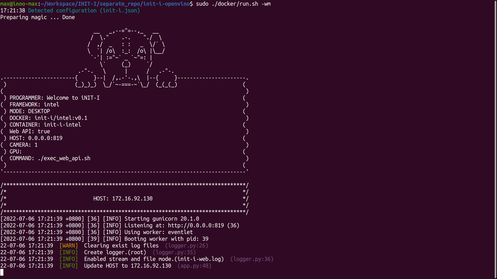

# iNIT-I-Intel
iNIT-I is an AI inference tool which could support multiple AI framework and this repository is just for intel platform.

* [Pre-requirements](#pre-requirements)
* [Build docker image](#build-docker-image)
* [Run DEMO](#run-demo)
* [Execute Web API](#execute-web-api)
* [Check Web API](#check-web-api)
* [Samples](#samples)

## Pre-requirements
* Install [Docker](https://docs.docker.com/engine/install/ubuntu/)

##  Build docker image
* Build from docker file
    
    We use [init-i.json](init-i.json) to manage environment, like "docker image name", "docker image version", "port number", etc. You can see more detail in [setup_environment.md](docs/setup_environment.md)
    ```bash
    sudo ./docker/build.sh
    ```

## Run DEMO
We use `task.json` to configure each AI tasks and using `<model>.json` to configure each AI models, check [ task configuration ](./docs/task_configuration.md) and [model configuration](./docs/model_configuration.md) to get more detail.

1. Enter container
    ```bash
    sudo ./docker/run.sh -m
    ```
2. Download model ( only in sample task ) and meta data.
    ```bash
    # Model
    ./task/classificaiton_sample/download_model.sh

    # Meta data
    ./task/classificaiton_sample/download_data.sh
    ```
3. Run demo script.
    ``` bash
    python3 demo.py --config task/classificaiton_sample/task.json
    ```

## Execute Web API
* Startup Web API in container
    ```bash
    sudo ./docker/run.sh -m
    ./exec_web_api.sh
    ```
* Startup Web API when running docker container
    ```bash
    sudo ./docker/run.sh -wm
    ```
    

## Check Web API
We recommand [Postman](https://www.postman.com/) to test your web api , you could see more detail in `<Your IP Address>:819/help` or `<Your IP Address>:819/apidocs`.


## Samples

name             | model                            | describe
-----------------|-----------------------------------------|--------------
Classification   | [Resnet50](https://docs.openvino.ai/latest/omz_models_model_resnet_50_tf.html)                              | Classification samples for OpenVINO
Object detection | [YOLOv3](https://docs.openvino.ai/latest/omz_models_model_yolo_v3_tf.html), [YOLOv4](https://docs.openvino.ai/latest/omz_models_model_yolo_v4_tf.html), [YOLOv3-tiny](https://docs.openvino.ai/latest/omz_models_model_yolo_v3_tiny_tf.html), [YOLOv4-tiny](https://docs.openvino.ai/latest/omz_models_model_yolo_v4_tiny_tf.html)| Object detection samples for OpenVINO
Segmentation     | [Deeplabv3](https://docs.openvino.ai/latest/omz_models_model_deeplabv3.html)                               | Segmentation samples for OpenVINO
Pose             | [OpenPose](https://docs.openvino.ai/latest/omz_demos_human_pose_estimation_demo_python.html#doxid-omz-demos-human-pose-estimation-demo-python),  [Associative Embedding ](https://docs.openvino.ai/latest/omz_demos_human_pose_estimation_demo_python.html#doxid-omz-demos-human-pose-estimation-demo-python)        | Pose samples for OpenVINO
