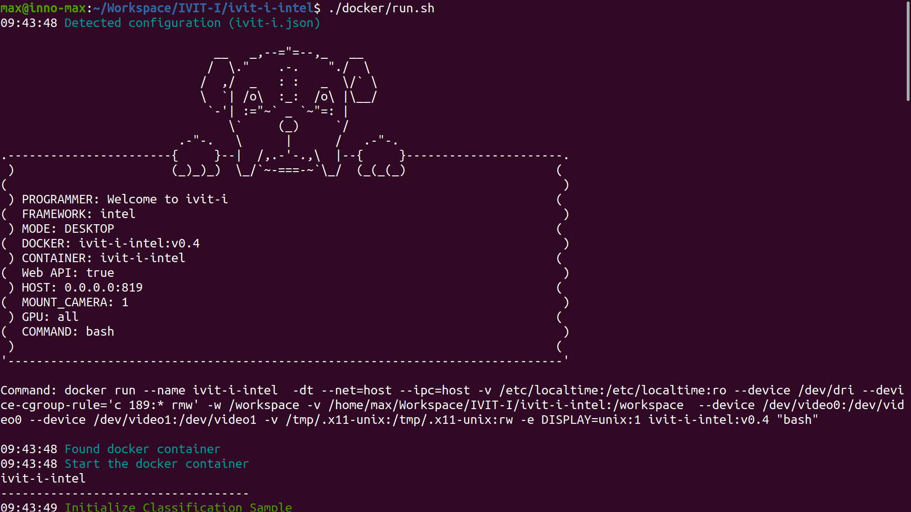
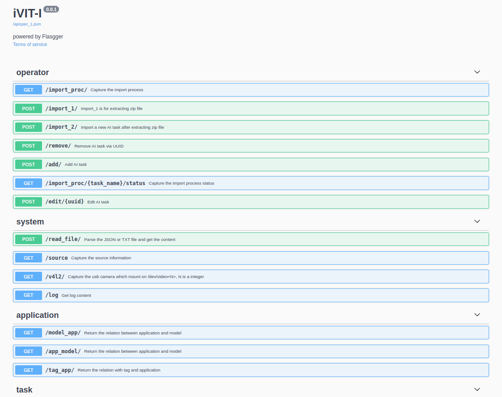

# iVIT-I-Intel
iNIT-I is an AI inference tool which could support multiple AI framework and this repository is just for intel platform.

* [Pre-requirements](#pre-requirements)
* [Prepare Environment](#prepare-environment)
* [Run Sample](#run-sample)
* [Fast Testing](#fast-testing)
* [Web API](#web-api)

# Pre-requirements
* [Docker](https://docs.docker.com/engine/install/ubuntu/)

# Prepare Environment

1. Clone Repository

    ```bash
    git clone  https://github.com/InnoIPA/ivit-i-intel.git && cd ivit-i-intel
    ```

    * Clone specificall branch
        ```bash
        VER=r1.0
        git clone --branch ${VER} https://github.com/InnoIPA/ivit-i-intel.git && cd ivit-i-intel
        ```
2. Run the docker container with web api

    * Run container with **web api**
        ```bash
        sudo ./docker/run.sh
        ```

    * Run container with **command line mode**
        ```bash
        sudo ./docker/run.sh -c
        ```

    * Run container without initialize sample
        ```bash
        sudo ./docker/run.sh -sc

        # if you need to initialize samples
        ./init_samples.sh

        # if you need to launch web api
        ./exec_web_api.sh
        ```

    * Run docker container step by step for developer

        Here is the [documentation](docs/activate_env_for_developer.md) explaining the workflow of `run docker container`.

    * Terminal Output

        
        

# Run Sample
We use `task.json` to configure each AI tasks and using `<model>.json` to configure each AI models, check [ task configuration ](./docs/task_configuration.md) and [model configuration](./docs/model_configuration.md) to get more detail.

1. Enter docker container
    ```bash
    ./docker/run.sh -c
    ```
2. Download model and meta data.
    ```bash
    # Model
    ./task/classification_sample/download_model.sh

    # Meta data
    ./task/classification_sample/download_data.sh
    ```
3. Run demo script.
    ``` bash
    python3 demo.py --config task/classification_sample/task.json
    ```
* Support Sample

    name             | model                            | describe
    -----------------|-----------------------------------------|--------------
    Classification   | [Resnet50](https://docs.openvino.ai/latest/omz_models_model_resnet_50_tf.html)                              | Classification samples for OpenVINO
    Object detection | [YOLOv3](https://docs.openvino.ai/latest/omz_models_model_yolo_v3_tf.html), [YOLOv4](https://docs.openvino.ai/latest/omz_models_model_yolo_v4_tf.html), [YOLOv3-tiny](https://docs.openvino.ai/latest/omz_models_model_yolo_v3_tiny_tf.html), [YOLOv4-tiny](https://docs.openvino.ai/latest/omz_models_model_yolo_v4_tiny_tf.html)| Object detection samples for OpenVINO
    Segmentation     | [Deeplabv3](https://docs.openvino.ai/latest/omz_models_model_deeplabv3.html)                               | Segmentation samples for OpenVINO
    Pose             | [OpenPose](https://docs.openvino.ai/latest/omz_demos_human_pose_estimation_demo_python.html#doxid-omz-demos-human-pose-estimation-demo-python),  [Associative Embedding ](https://docs.openvino.ai/latest/omz_demos_human_pose_estimation_demo_python.html#doxid-omz-demos-human-pose-estimation-demo-python)        | Pose samples for OpenVINO
    Yolov4-tiny    |  [YOLOv3](https://docs.openvino.ai/latest/omz_models_model_yolo_v3_tf.html), [YOLOv4](https://docs.openvino.ai/latest/omz_models_model_yolo_v4_tf.html), [YOLOv3-tiny](https://docs.openvino.ai/latest/omz_models_model_yolo_v3_tiny_tf.html), [YOLOv4-tiny](https://docs.openvino.ai/latest/omz_models_model_yolo_v4_tiny_tf.html)| Object detection samples for OpenVINO


# Fast Testing
We provide the fast-test for each sample, please check the [document](./test/README.md).


# Web API
<details>
    <summary>
        We recommand <a href="https://www.postman.com/">Postman</a> to test your web api , you could see more detail in <code>{IP Address}:{PORT}/apidocs</code>.
    </summary>
    
</details>
<br>
